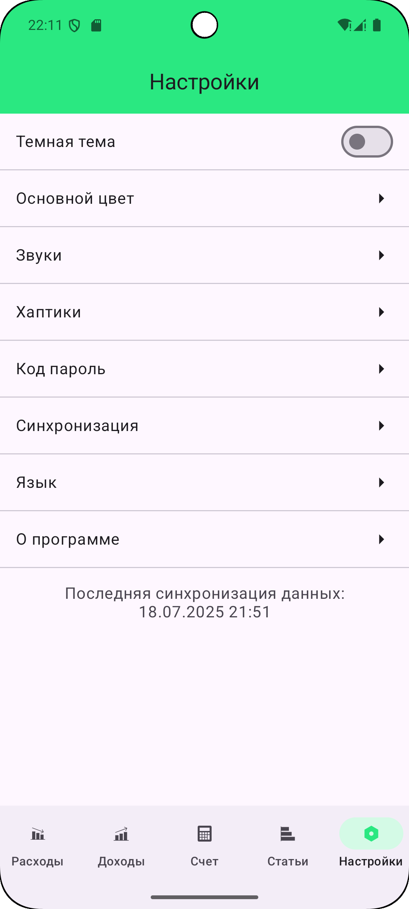
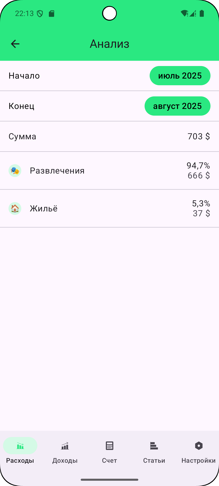
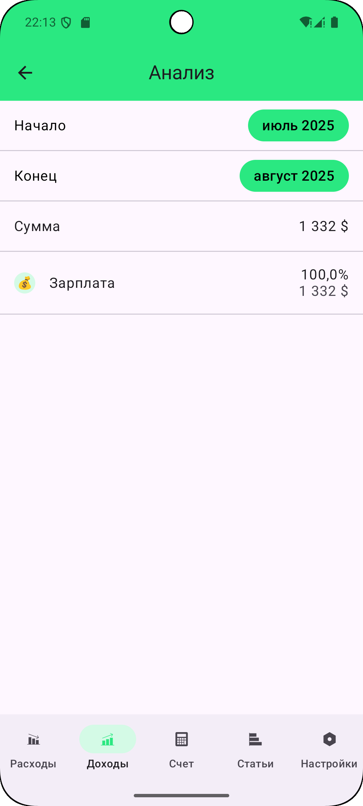

Итоги шестого задания

## Токен

Чтобы приложение работало, вы должны добавить свой токен в ``local.properties``

 

 

## Аккаунт

ID тестового аккаунта так же можно поменять в ``local.properties``, иначе будет браться первый

 

 

## Синхронизация данных

Синхронизация даных осуществляется через воркеры и репозитории, воркеры лежат здесь ``/data/sync``.

Автоматическая же синхронизация (при запуске, при появлении сети, регулярная) осуществляется в
``App`` и ``/core/network/NetworkMonitor``

Дата последней синхронизации отображается на экране Настройки:

 

 

Так же есть всплывающее уведомление, отображающее состояние синхронизации, но в его работе я пока не
уверен

## Экран Аналитика

 
 
 

