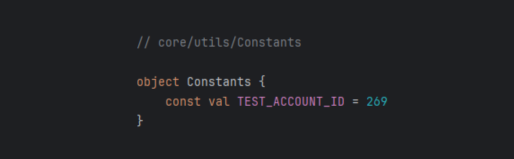
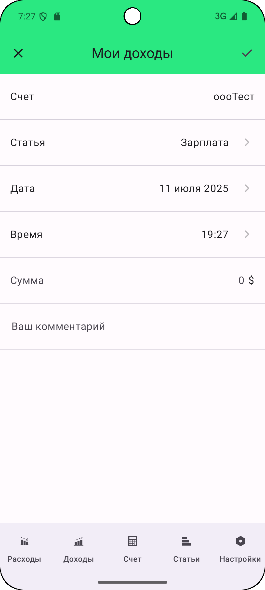
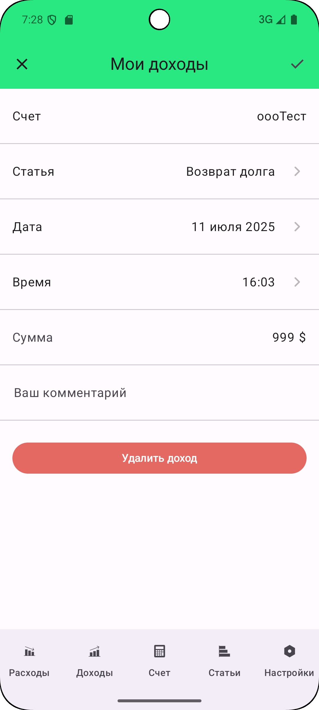

Итоги пятого задания

## Токен

Токен никуда не выносил, нужно поменять его в файле ``/core/di/NetworkModule``

 

 

## Аккаунт

ID тестового аккаунта можно поменять в файле ``/core/utils/Constants``

 

 

## DI

Все, что связано с DI находится в ``/core/di``

## Многомодульность

Многомодульности нет, не ищите :)

## Демонстрация экранов

  

