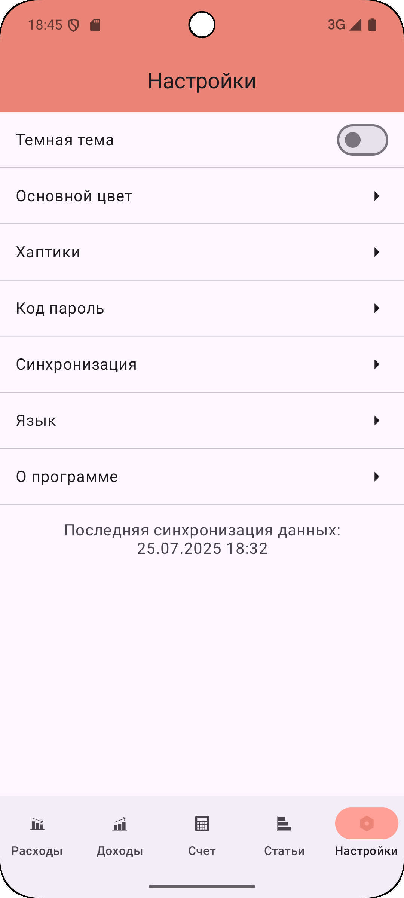

Итоги седьмого задания

## Задание

Выполнена лишь вторая часть выданного задания:

- Переключение темы
- Смена основного цвета
- Хаптики
- Пин-код
- Изменение частоты синхронизации с бекендом
- Переключение языка
- Информация о приложении

## Токен

Чтобы приложение работало, вы должны добавить свой токен в ``local.properties``

 

 

## Аккаунт

ID тестового аккаунта так же можно поменять в ``local.properties``, иначе будет браться первый

 

 

## Переключение темы

 
 
 

## Изменение основного цвета

 
  
 

## Хаптики

 

 

## Пин-код

 

 

## Переключение языка

 
 
 

